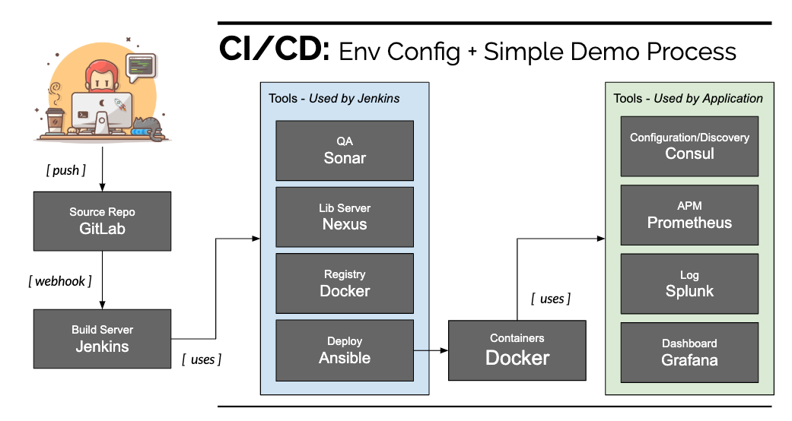

# engage-ci-cd-setup

Local Environment Setup and a Simple Demo Project to illustrate the whole CI/CD process.

## Overview



---

## Toolkit

- **Infrastructure**

  - Ansible (v2.9.2)

- **Code Repository**

  - Github (Hosts Demo project)
  - Gitlab (Used for local repository <em>\* Not this sample</em>)

- **Build and Deploy**

  - Maven
  - Jenkins

- **Quality Assurance**

  - Sonar

- **Library Repository**

  - Nexus

- **Container**

  - Docker
  - Docker Registry

- **Distributed Configuration**

  - Consul

- **Metrics, Data Evaluation and Presentation**
  - Prometheus
  - Splunk
  - Grafana

---

## Environment Setup with Ansible

Ansible will be in charge to compose the whole environment used for this demo. Find below detailed steps.

## Ansible Installation Required

Ref. [Ansible Installation](https://docs.ansible.com/ansible/latest/installation_guide/intro_installation.html)

## Step 1 - Setup Ansible Hosts

File location: /etc/ansible/hosts.<br />
_It is required to replace HOST_IP key in the code snippets below_

```
[servers]
HOST_IP ansible_connection=ssh ansible_port=22 ansible_user=smiguelnet ansible_python_interpreter=/usr/bin/python3 ansible_become=true ansible_become_user=root ansible_become_password=smiguelnet
```

Checking host connectivity

```
ansible servers -m ping
```

## Step 2 - Installing Docker at destination hosts

```sh
ansible-playbook docker-playbook.yml
```

## Step 2 - Running docker-compose at destination hosts

```sh
ansible-playbook docker-compose-playbook.yml
```

---

## Services URL

- Jenkins <br /> http://HOST_IP:9091/

- Nexus <br /> http://HOST_IP:8081/

- Consul <br /> http://HOST_IP:8500/

- Prometheus <br /> http://HOST_IP:9090/

- Grafana <br /> http://HOST_IP:3000/

- Sonar <br /> http://HOST_IP:9000/

- Splunk <br /> http://HOST_IP:8000/

- Docker Registry Images <br /> http://HOST_IP:5000/v2/_catalog

- Sample App <br /> http://HOST_IP:8080/

---

## Demo Project

- **sample-app** <br /> https://github.com/smiguelnet/sample-app-ci-cd

---

## Useful commands

In case you need to rebuild the images

```
docker-compose build --no-cache
```

Get Jenkins password

```
docker exec jenkins cat /home/jenkins/secrets/initialAdminPassword
```

Get Nexus password

```
docker exec nexus cat nexus-data/admin.password
```

---

## License

**engage-ci-cd-setup** is licensed under an Apache-2.0 license
